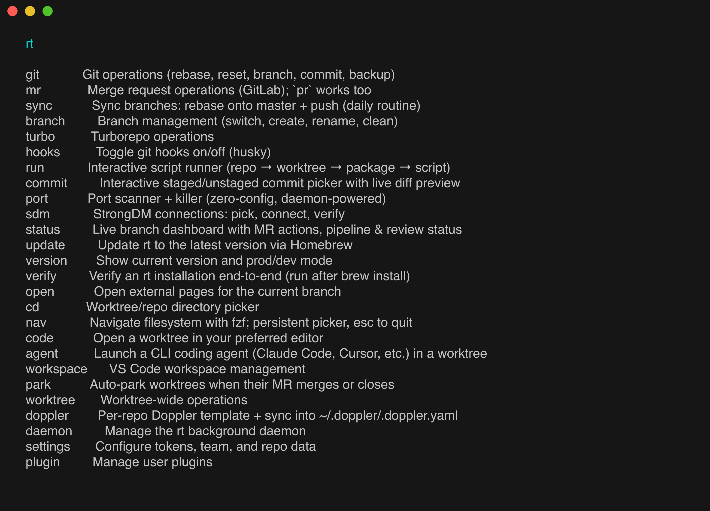

# rt

rt is a macOS developer CLI for git worktree workflows. It gives you fuzzy
worktree navigation, safer git rebase and reset, worktree lifecycle management,
a zero-config port killer, and StrongDM connections, all backed by a background
daemon. A menu bar app, an editor status-bar extension, and a plugin system for
your own commands ship with it.

Full documentation lives at **[rt.cool](https://rt.cool)**.



rt is the command line piece of mattstack, a small estate of tools that share
its daemon and settings: [gitq](https://github.com/m4ttstack/gitq) for stacked
branches, [board](https://github.com/m4ttstack/board) for reviewing merge
requests, [glance](https://github.com/m4ttstack/glance) for one GitHub and
GitLab client, [deck](https://github.com/m4ttstack/deck) for local app hosting,
[fast-browser](https://github.com/m4ttstack/fast-browser) for driving Chrome,
[skills](https://github.com/m4ttstack/skills) and the
[marketplace](https://github.com/m4ttstack/mattstack-marketplace) that installs
them, and [herdr-chat](https://github.com/m4ttstack/herdr-chat) for agents
living on [herdr](https://github.com/herdrdev/herdr).

## Contents

- [Features](#features)
- [Installation](#installation)
- [Quickstart](#quickstart)
- [Everyday commands](#everyday-commands)
- [Configuration](#configuration)
- [Plugins](#plugins)
- [The menu bar app and editor extension](#the-menu-bar-app-and-editor-extension)
- [Requirements](#requirements)
- [Development](#development)
- [Contributing](#contributing)
- [License](#license)

## Features

- **Worktree-first navigation.** `rt cd` and the `rtcd` shell alias are one
  fuzzy picker across every repo and worktree on disk. `rt nav` walks the
  filesystem with image previews; `ctrl-o` opens the selection in your editor.
- **Worktree lifecycle.** `rt worktree provision` claims a tree for a ticket or
  branch, from a warm on-deck pool or freshly created. `dispose`, `restore`,
  `freshen`, and `each` cover the rest.
- **Safer git operations.** `rt git rebase` auto-resolves what it safely can
  onto `origin/master`; `rt git push force` uses `--force-with-lease`;
  `rt sync` rebases and pushes the current worktree in one step.
- **Zero-config port scanning.** `rt port` finds and kills processes on stale
  dev ports with no setup at all.
- **A background daemon.** It caches branch and merge-request data, scans
  ports, guards git hooks, snapshots your home repo, and runs cron triggers, so
  commands stay fast from anywhere on your machine.
- **Agent plumbing.** `rt agent` hands a prompt to a Claude Code session and
  keeps the receipt, `rt chat` is group chat for the agents and their human,
  and `rt events` is an event bus panes and skills can wait on.
- **StrongDM connections.** `rt sdm connect` reads your real StrongDM catalog
  and connects with friendly names, with no list to maintain.
- **A safe plugin system.** Drop a folder under `~/.mattstack/rt/plugins/` to
  add your own commands. A broken plugin is skipped with a warning and can
  never crash rt itself.
- **Pickers everywhere, and none in the way.** Omitting a subcommand or a
  required argument shows a picker; a non-TTY, `--json`, or `RT_BATCH` run gets
  the plain error and the plain output instead, so scripts and agents drive the
  same commands humans do.

## Installation

rt is distributed inside **mattstack.app**, a macOS menu bar app. Download
`mattstack-<version>.dmg` from
[GitHub Releases](https://github.com/m4ttstack/rt/releases), drag
**mattstack.app** to `/Applications`, and open it. The app walks you through
setup and installs `rt`, the daemon, the editor extension, and shell
integration.

`rt` is not a separate download. It ships inside the bundle at
`Contents/MacOS/rt` and gets linked onto your `PATH` during setup. Updates
arrive through the app via Sparkle.

To drive the same install from a terminal, on a fresh machine, a VM, or CI:

```bash
/Applications/mattstack.app/Contents/MacOS/rt --post-install
rt verify
```

Run it from `/Applications`, not from the mounted DMG. rt refuses to install
itself from a disk image or a Gatekeeper-translocated copy.

### What gets installed

| Component | Description |
|---|---|
| `rt` binary | Ships inside mattstack.app (`Contents/MacOS/rt`), linked at `~/.local/bin/rt` |
| `mattstack.app` | Menu bar app: daemon health, notifications, auto-updates |
| Background daemon | Caches branch and MR data, scans ports, guards git hooks, snapshots the home repo |
| `rt-context` extension | VS Code / Cursor: worktree, branch, and linked ticket in the status bar |
| Shell integration | `~/.local/bin` on `PATH` plus the `rtcd` alias, for zsh, bash, and fish |
| Bundled helpers | `jq`, `gh`, `glab`, `bun`, `node`, `sops`, `age-keygen`, `cloudflared`, `fast-browser`, and `gitq`, among others, pinned and shipped inside the app rather than installed onto your system |

Most helpers stay inside `Contents/Helpers/` and are resolved by absolute path.
Only the ones meant to be typed (`rt`, `fast-browser`, `gitq`, `deck`) are
exposed as links in `~/.local/bin`.

### Upgrading

```bash
rt update
```

mattstack.app owns the whole upgrade lifecycle through Sparkle: signature
verification, staged install, restart. `rt update` only asks the app to check.
It never downloads or installs anything itself, and it points you at the latest
release if the app is not running.

## Quickstart

Set your tokens once. They apply to every repo:

```bash
rt settings linear token     # Linear API key, for ticket lookup
rt settings gitlab token     # GitLab personal access token, for MR data
rt settings linear team      # default Linear team
```

Then check the install is healthy and start using it:

```bash
rt verify        # read-only health report for every piece of the install
rt              # interactive menu: repo, then worktree, then action
rt cd           # fuzzy picker across every repo and worktree
rt port         # list dev ports; `rt port kill` to reclaim one
```

Every command also works as a direct invocation, so once you know the shape you
can skip the picker:

```bash
rt <command> [subcommand] [args]
```

### Onboarding a repo

There is no explicit "add repo" step for everyday use. Any git repo is indexed
the first time you run a repo-aware `rt` command inside it:

```bash
cd ~/code/my-repo
rt cd
```

On that first invocation rt derives a stable identity for the repo from
`git config --get remote.origin.url` (a repo with no origin gets a
path-based identity instead), records it in the index inside
`~/.mattstack/rt/state.db`, and creates a per-repo data directory under
`~/.mattstack/rt/repos/`.

Indexing is not the same as background tracking. The daemon only refreshes
data for repos you have explicitly granted:

```bash
rt repos register --track live     # index this repo and grant background tracking
rt daemon track                    # per-repo tracking: live, poll, or off
rt repos prune                     # drop repos that no longer exist on disk
```

Once a repo is tracked, merge-request data refreshes every 5 minutes and port
scans run about every 30 seconds while something is asking for them.

## Everyday commands

Run `rt` with no arguments for the interactive menu. Every command below also
takes its arguments directly.

### Navigation

```bash
rt cd                     # fuzzy worktree/repo directory picker
rt cd --worktree feat/x   # jump straight to a worktree by branch prefix
rt nav                    # filesystem picker; ctrl-o opens in your editor
rt code                   # open a worktree in your preferred editor
rtcd                      # shell alias: cd into a picked worktree
```

`rtcd` is the one that changes your shell's directory. `rt cd` prints the path,
and the alias installed by setup does the `cd`.

### Worktrees

```bash
rt worktree provision     # claim a worktree for a ticket or branch
rt worktree create        # create a fresh worktree, optionally into the on-deck pool
rt worktree list          # list worktrees
rt worktree freshen       # bring worktrees up to date
rt worktree dispose       # dispose a worktree (recoverable)
rt worktree restore       # restore a disposed worktree from its trash entry
rt worktree each <cmd>    # run a command in each worktree
rt worktree adopt         # one-shot: adopt an unmanaged repo's worktrees
```

### Git

```bash
rt git rebase             # smart rebase onto origin/master with auto-resolve
rt git rebase onto        # rebase onto a specific branch
rt git pull               # pull from origin
rt git push               # push to origin/<branch>, fixing a wrong upstream
rt git push force         # push with --force-with-lease, after a rebase or amend
rt git upstream           # fix the branch upstream to track origin/<branch>
rt git reset origin       # sync with origin after a remote rebase
rt git reset soft         # soft reset to HEAD (unstage files)
rt git reset hard         # hard reset to HEAD (discard all changes)
rt git commit             # interactive staging + commit with live diff preview
rt git backup             # back up the current branch to a backup ref
rt git restore            # restore from a backup branch
```

```bash
rt sync                   # rebase the current worktree onto master, then push
rt sync all               # sync every worktree in the repo
```

### Running things

```bash
rt run                    # interactive script runner: repo, worktree, package, script
rt runner                 # board of long-running commands in tmux or herdr panes
rt port                   # port scanner and killer
rt hooks                  # toggle git hooks on and off (husky)
```

### Daemon

```bash
rt daemon install         # install and start the daemon (launchd)
rt daemon uninstall       # stop and remove it
rt daemon start|stop|restart
rt daemon status          # pid, uptime, tracked repos, ports
rt daemon track           # per-repo background tracking: live, poll, off
rt daemon logs            # tail the log stream
rt daemon log-level       # show or set the live log level
```

### Everything else

```bash
rt verify                 # installation health, --ci and --json variants
rt version                # version plus mode (dev or prod)
rt --version              # just the version string
rt update                 # ask mattstack.app to check for an update
rt uninstall              # reverse setup: services, links, plugins
```

The [`board`](https://github.com/m4ttstack/board) app is where merge requests
get reviewed; rt keeps the data it needs warm but no longer renders a dashboard
of its own.

## Configuration

### Global settings

```bash
rt settings linear token       # Linear API key
rt settings linear team        # default Linear team
rt settings gitlab token       # GitLab personal access token
rt settings notifications      # which events fire native macOS notifications
rt settings runaway            # runaway process detection thresholds
rt settings extension          # install the rt-context extension into local editors
rt settings dev-mode           # toggle between local source and the installed binary
```

Every key any mattstack app reads goes through one settings resolver, with
user, team, and machine scopes layered weakest first:

```bash
rt settings list                            # every registered setting and its resolved value
rt settings get <key>                       # a value plus where it came from
rt settings set <key> <value> --scope user  # write into one store: user, team, or machine
rt settings explain <key>                   # the full scope chain, weakest first
```

`docs/settings-architecture.md` covers the scope model and the registry.

### Per-repo settings

| Command | When you need it |
|---|---|
| `rt hooks` | The repo uses husky and you want a quick on/off toggle |
| `rt repos register --track` | You want the daemon refreshing this repo in the background |

### Where rt keeps state

Everything lives under `~/.mattstack/`, and rt never writes anything into the
repos it manages.

| Path | Contents |
|---|---|
| `~/.mattstack/rt/state.db` | The repo index, settings, run state, and key-value store |
| `~/.mattstack/rt/repos/` | Per-repo data directories, keyed by repo identity |
| `~/.mattstack/rt/plugins/` | Your plugins |
| `~/.mattstack/rt/logs/` | JSON-lines logs per surface, readable via `rt daemon logs` |
| `~/.mattstack/user/` | The git-backed personal repo, see [docs/home-repo.md](docs/home-repo.md) |

An older `~/.rt` tree is migrated into place automatically on first run.

### The home repo

`~/.mattstack/user` is a personal git repo that the daemon keeps committed and
pushed for you, minus any paths you have claimed while mid-edit. See
[docs/home-repo.md](docs/home-repo.md) for `rt home init`, zones, the janitor
rule, and the `rt.homeSnapshot` configuration key.

### StrongDM

`rt sdm connect` reads your live StrongDM catalog, so there is nothing to
configure. An optional declarative file can add friendly labels, tiers, and
connect defaults. See [docs/strongdm.md](docs/strongdm.md).

## Plugins

Add your own commands to rt. A plugin is a folder under
`~/.mattstack/rt/plugins/<name>/` with a `plugin.json` manifest and TypeScript
files, or existing executables. Plugin commands get rt's navigation,
repo and worktree context resolution, argument forms, and logging for free.

```bash
rt plugin new my-tool     # scaffold the folder + IDE types
rt my-tool                # run it: edit the .ts file and rerun, no build step
rt plugin list            # installed plugins and their health
rt plugin validate        # deep checks: files exist, modules import, exports match
```

A command is either TypeScript (`"module": "./my-tool.ts"`, which receives an
injected `ctx.rt` API for pickers, prompts, scoped storage, and logging) or any
executable (`"exec": "./scripts/deploy.sh"`, which receives `RT_*` environment
variables). Commands merge into the root tree; name collisions are flagged and
built-ins always win.

Three things worth knowing:

- The runtime contract is the standard library plus the injected API. npm
  dependencies in plugin runtime code are not supported in v1.
- Plugin code runs in-process with rt's privileges. Only install plugin
  directories you trust. Reading a third-party plugin before installing it is
  reading the code you are about to run.
- `apiVersion: 1` is required in every manifest.

Full guide, with the manifest reference, the injected API, exec environment
variables, and troubleshooting: [docs/plugins.md](docs/plugins.md).

## The menu bar app and editor extension

mattstack.app sits in the menu bar and shows daemon health at a glance:

| Dot | Meaning |
|---|---|
| Green | Daemon running normally |
| Yellow | Daemon starting |
| Orange | Pending notifications, or a runaway process detected |
| Pink | Daemon reachable but reporting itself unhealthy |
| Red | Daemon not reachable |
| Grey | State unknown |

From its menu you can restart or stop the daemon, toggle launch-at-login, and
check for updates.

The `rt-context` extension for VS Code and Cursor puts your worktree, branch,
and linked ticket in the editor status bar:

```
📁 main-worktree  │  🔖 ACME-1287: Add damage photo uploads
```

Clicking the item opens the linked ticket. Setup installs it into every
detected editor; `rt settings extension` reinstalls it or adds more editors
through a fuzzy picker.

## Requirements

| Dependency | Notes |
|---|---|
| macOS on Apple silicon | Required. rt ships an arm64 build only; Intel Macs are not supported |
| Xcode Command Line Tools | Required. `rt verify` reports a missing installation |
| `tmux` | Optional. Only `rt runner`'s default backend needs it; `rt runner --herdr` does not |
| `chafa` | Optional. Renders image previews in `rt nav` as colored character art |
| `kitten` | Optional. Upgrades `rt nav` previews to true pixels on Kitty-protocol terminals such as Ghostty |

## Development

rt is built with [Bun](https://bun.sh). Day-to-day development runs the CLI
straight from source, with no compile step:

```bash
git clone https://github.com/m4ttstack/rt.git
cd rt
bun install
bun run cli.ts            # run the CLI from source
bun run cli.ts verify     # any subcommand works the same way
```

`rt --version` reports `dev` when running from source. If mattstack.app is
already installed alongside your checkout, `rt settings dev-mode` swaps
`~/.local/bin/rt` between your source tree and the compiled binary.

### Tests and checks

```bash
bun run test              # unit tests across lib, commands, packages, scripts
bun run test:e2e          # end-to-end suite
bun run ui:test           # go vet ./... && go test ./... for the rt-ui helper
bunx tsc --noEmit         # typecheck
bun run docs:check        # the generated command reference is in sync
bun run picker:check      # every required positional declares its omit behavior
scripts/repo-purity.sh    # no employer or customer references in the tracked tree
```

CI runs all of these on every pull request.

### Layout

| Path | What lives there |
|---|---|
| `cli.ts`, `commands/`, `lib/` | The CLI: dispatch, command handlers, and shared logic |
| `lib/command-tree-def.ts` | The single source of truth for command names, args, and structure |
| `ui/` | The Go `rt-ui` helper that renders prompts, spinners, and the runner board |
| `rt-tray/` | The Swift menu bar app and the bundle build |
| `extensions/vscode/rt-context/` | The editor status-bar extension |
| `packages/rt-client/` | The published client other mattstack apps use |
| `website/` | The rt.cool documentation site |
| `docs/` | Design and operations documents |

The TypeScript CLI renders no UI itself. Prompts, spinners, boards, and
pickers all go through the Go helper. That boundary is enforced by a test.

For dev mode, the installer, local compiled builds, the editor extension, the
menu bar app, and the release pipeline, see
[docs/development.md](docs/development.md).

## Contributing

Issues and pull requests are welcome at
[github.com/m4ttstack/rt](https://github.com/m4ttstack/rt).

Before opening one:

- Run `bun run test`, `bunx tsc --noEmit`, and `bun run picker:check`.
- Run `scripts/repo-purity.sh`. This repo is public, and the gate keeps
  employer, customer, and internal-system references out of the tracked tree.
  Use neutral placeholders such as `acme`, `ACME-1234`, and
  `gitlab.example.com`.
- Add a new command to `lib/command-tree-def.ts`, register its module in
  `lib/module-registry.ts`, and run `bun run docs:gen` so the reference page
  exists.
- Keep the commit message short and imperative.

## License

MIT. See [LICENSE](LICENSE).
